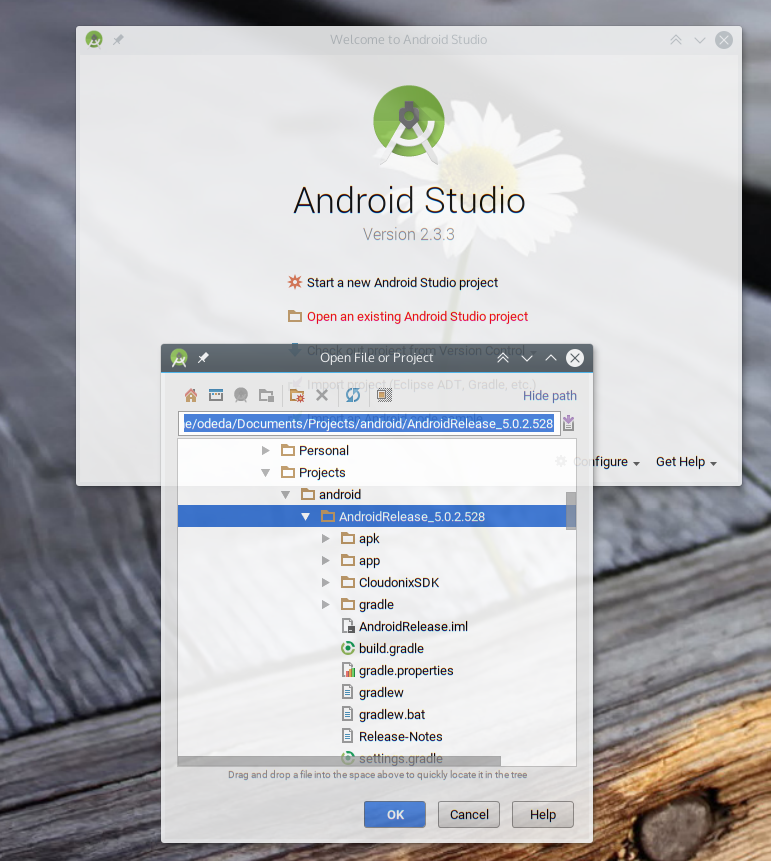
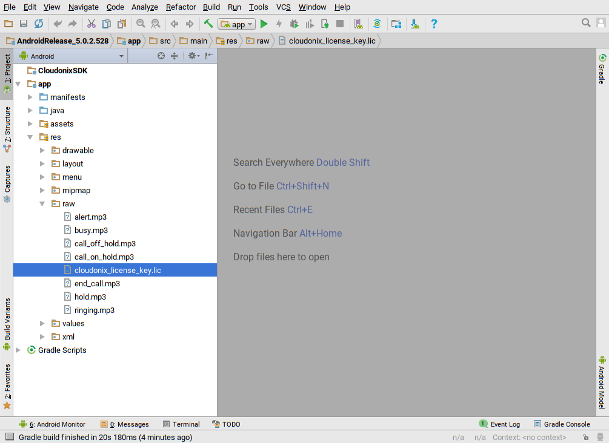
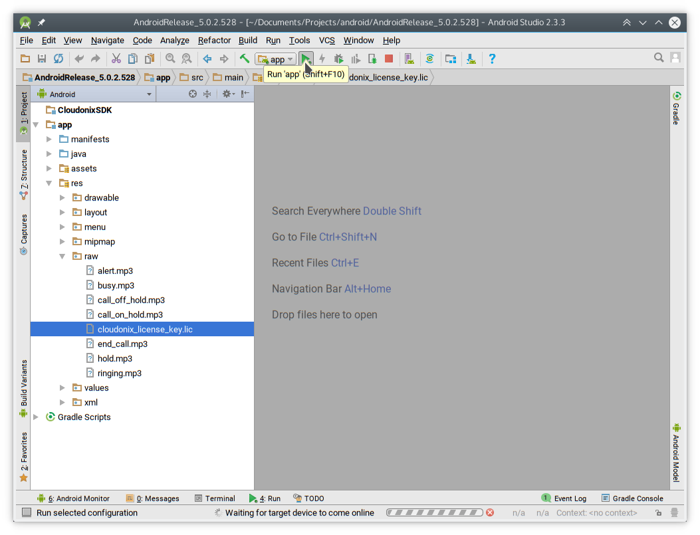
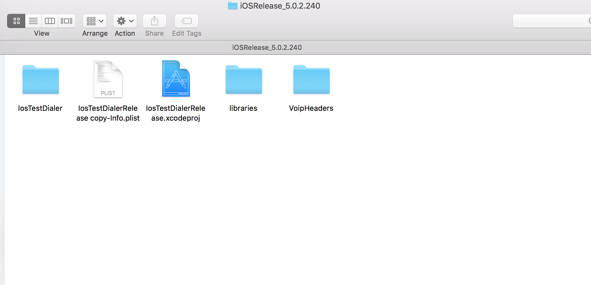
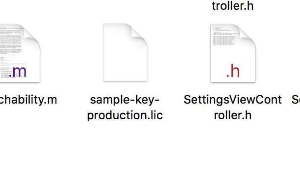
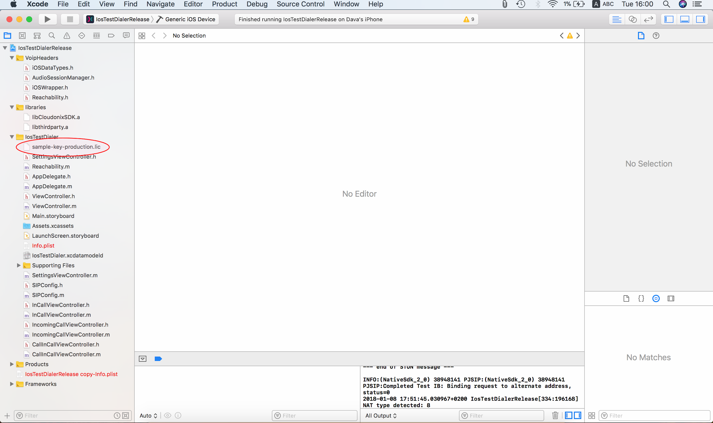

.. _h576e4e6a7c175a6237a337f1a41101c:

Cloudonix Mobile Application -
##############################

.. _h34252f67623a57332a5821397d186754:

Developer Guide
###############

| `Introduction <#hb79795d3e46b47696c7c5b6d3a41e>`_
| `Getting Started <#h416474541d6069316f595d5ca5865>`_
|     `Android <#h184e304739c2564256d4e3755797c6d>`_
|         `Project Setup <#h28765139366a50513d4662f53a6d>`_
|         `Deploying License Key <#h5c15f4777465e526a1f7f3b363a716b>`_
|         `Build and Run Project <#h44a2342bf5e6313c968d9847>`_
|     `iOS <#h1b2160596f6ed4f1c438507e43c15>`_
|         `Project Setup <#h28765139366a50513d4662f53a6d>`_
|         `Deploying License Key <#h5c15f4777465e526a1f7f3b363a716b>`_
|         `Build and Run Project <#h44a2342bf5e6313c968d9847>`_
| `Application Workflows <#h2117d145b58417d1f71715226f342f>`_
|     `Initialization <#h6144276a2c1f8026527c4120192a175c>`_
|         `Android <#h184e304739c2564256d4e3755797c6d>`_
|             `Example Initialization <#h314ab72f64276443635562971243f>`_
|     `Registration and Registration-Free Setup <#h4a7c7485e4a3c4415255204441254>`_
|         `Android Example <#h3f135278793351e196a617f1c411414>`_
|     `Dialing <#h5e6e2a356a1e74d725e7a6d43777e4c>`_
|         `Android Example <#h3f135278793351e196a617f1c411414>`_
|     `Call Reception <#h3228125030f1d236d377a6d7a621b3a>`_
|     `Application Shutdown <#h393f7e5461c215d7e7892a3b665d7f>`_
| `Reference <#h632b4696f2729637a175f850576736>`_
| `SDK Integration Notes <#h5c133e4179285214224d31525075576e>`_
|     `Android <#h184e304739c2564256d4e3755797c6d>`_
|     `iOS - Xcode <#h512517c47d4f326c7e488707f4f5d>`_

.. _h2c1d74277104e41780968148427e:

.. _hb79795d3e46b47696c7c5b6d3a41e:

Introduction
************

This is the mobile application developer guide for the Cloudonix Mobile SDK release 5.3. It will help you integrate the Cloudonix Mobile SDK into your Android or iOS mobile application.

.. _h416474541d6069316f595d5ca5865:

Getting Started
***************

The Cloudonix Mobile SDK is distributed with a sample dialer application to help you get started. The sample dialer application demonstrate how to use the SDK to connect to a SIP service and allows the user to call through the SIP service using a dial pad or a contact list.

The following sections cover setting up the Cloudonix Mobile SDK sample application and running it.

.. _h184e304739c2564256d4e3755797c6d:

Android
=======

Please note that Cloudonix Mobile SDK release 5.3 is supported on Android Studio up to version 2.3.3.

.. _h28765139366a50513d4662f53a6d:

Project Setup
-------------

Download the release package and extract it in your projects folder. Then use the Android Studio to open the project:

\ |IMG1|\ 

.. _h5c15f4777465e526a1f7f3b363a716b:

Deploying License Key
---------------------

After the project loads, navigate to app > res > raw , and replace the empty place-holder file cloudonix_license_key.lic with the license file you’ve received from Cloudonix.

\ |IMG2|\ 

The file name should either be kept the same as in the sample project, or otherwise you can change the name of the file loaded by the sample application by editing the loadLicenseKey() method in the net.Cloudonix.iotech.cloudonixsdk.cloudonixdialer.utils.VoIPClient class.

.. _h2c1d74277104e41780968148427e:

.. _h2c1d74277104e41780968148427e:

.. _h44a2342bf5e6313c968d9847:

Build and Run Project
---------------------

At this point you should be able to click the “Run” button to start the sample dialer application on a connected device or an emulated device.

\ |IMG3|\ 

.. _h2c1d74277104e41780968148427e:

.. _h2c1d74277104e41780968148427e:

.. _h1b2160596f6ed4f1c438507e43c15:

iOS
===

.. _h28765139366a50513d4662f53a6d:

Project Setup
-------------

Download the release package and extract it in your projects folder.

\ |IMG4|\ 

.. _h5c15f4777465e526a1f7f3b363a716b:

Deploying License Key
---------------------

You should have an IosTestDialer folder in the project directory, into which the license key file should be copied, and renamed to sample-key-production.lic \ |IMG5|\ 

.. _h44a2342bf5e6313c968d9847:

Build and Run Project
---------------------

Open the sample application project file IosTestDialerRelease.xcodeproj to open the project in Xcode, then use the “Build and Run” command from Xcode:

\ |IMG6|\ 

.. _h2117d145b58417d1f71715226f342f:

Application Workflows
*********************

.. _h6144276a2c1f8026527c4120192a175c:

Initialization
==============

In order to use the Cloudonix Mobile SDK in your application, it must first be initialized with the license key (which you receive from Cloudonix, either a trial or a production license key). The application would load the license key into the Cloudonix Mobile SDK in order to retrieve an instance to the Cloudonix Mobile SDK control object (commonly called “instance” in this guide). This process will verify the license, configure the SDK for the device by utilizing Cloudonix online device configuration service and will eventually issue the onLicense event, which can be monitored by the application to check if the licensing process completed successfully. If the licensing process failed - for example if the license key is corrupt or has expired - then the SDK will not be operational.

After initializing the SDK, it needs to be configured with configuration parameters such as allowed codecs and transports, in addition to setting the SIP account details that will be used for calling and receiving calls.

.. _h184e304739c2564256d4e3755797c6d:

Android
-------

After receiving the SDK client instance, the application should perform these additional steps:

#. Call addEventsListener() to be able to receive events from the SDK using callbacks on a IVoIPObserver instance.

#. Call initPreferences() which is needed for the Android Cloudonix Mobile SDK service to be able to handle incoming calls to the application even when it isn’t in the foreground. 

#. Use setConfig() to set up the SDK.

#. Call checkBinder() to see if the SDK service is still running and can be reused. If the service is running, this call will attach to the existing service.

#. If checkBinder() returned false, the application needs to call bind() to create and connect a new instance of the SDK service. After that process is complete, the SDK will fire the onLicense() event with LicensingState set to LICENSING_SUCCESS to let the application know that the service is ready and licensed correctly. 

#. At this point the application can call setConfig() to override any default configuration parameters of the SDK then call setConfiguration() with the SIP account registration information.

#. The setConfiguration() call will instruct the SDK to setup the SIP stack and when process is complete, the SDK will fire the onSipStarted() event.

#. Once onSipStarted() is called, the application can start communication flows such as registering and dialing.

.. _h47426cb124741c5c766a535c461f12:

Android Example Initialization
~~~~~~~~~~~~~~~~~~~~~~~~~~~~~~

+--------------------------------------------------------------------------+
|public class VoIPClient implements IVoIPObserver {                        |
|                                                                          |
|  CloudonixSDKClient instance;                                            |
|                                                                          |
|  Private initSDK(Context ctx) {                                          |
|                                                                          |
|    InputStream input = ctx.getResources().openRawResource(R.raw.license);|
|                                                                          |
|    try {                                                                 |
|                                                                          |
|      String lic = new String(CryptUtils.convertStreamToByteArray(input));|
|                                                                          |
|      instance = CloudonixSDKClient.getInstance(lic);                     |
|                                                                          |
|      instance.addEventsListener(this);                                   |
|                                                                          |
|      instance.initPreferences(ctx);                                      |
|                                                                          |
|      if (instance.checkBinder())                                         |
|                                                                          |
|        return;                                                           |
|                                                                          |
|      instance.bind(); // will cause onSipStarted to be called            |
|                                                                          |
|    } catch (IOException e) {                                             |
|                                                                          |
|      e.printStackTrace();                                                |
|                                                                          |
|    }                                                                     |
|                                                                          |
|  }                                                                       |
|                                                                          |
|  @Override                                                               |
|                                                                          |
|  public void onLicense(LicensingState state, String description) {       |
|                                                                          |
|    // handle licensing problems                                          |
|                                                                          |
|    instance.setConfig(ConfigurationKey.USER_AGENT, "MyApp/1.0");         |
|                                                                          |
|    instance.setConfiguration(new RegistrationData() {{                   |
|                                                                          |
|      setServerUrl("sip.server.net");                                     |
|                                                                          |
|      setDomain("my.service.com");                                        |
|                                                                          |
|      …                                                                   |
|                                                                          |
|    }});                                                                  |
|                                                                          |
|  }                                                                       |
|                                                                          |
|  @Override                                                               |
|                                                                          |
|  public void onSipStarted() {                                            |
|                                                                          |
|  }                                                                       |
|                                                                          |
|}                                                                         |
+--------------------------------------------------------------------------+

.. _h4a7c7485e4a3c4415255204441254:

Registration and Registration-Free Setup
========================================

The Cloudonix Mobile SDK supports both classic SIP accounts using periodic REGISTER messages to maintain “connection” to the server, as well as Cloudonix Registration-Free mode.

.. _h5267c29287475784d707551703e7b35:

Classic mode (“registration”)
-----------------------------

In a classic SIP registration use case, the application should:

#. Make sure the RegistrationData contains the correct username and password during the configuration step.

#. In order to receive calls, call registerAccount() after the Cloudonix Mobile SDK notifies the application that the SIP stack has started through the onSipStarted() event.

After calling registerAccount() the Cloudonix Mobile SDK will fire the onRegisterState() event whenever the registration state changes. The application can also call isRegistered() to check the registration status.

Please note that for the  registerAccount() call to succeed, the user authorization credentials should have already been set using the setConfiguration() call.

Regardless if the application has called registerAccount() or not, after the SIP stack was started, the application may call dial() or dialWithHeaders() to start a call using the configured user authorization credentials.

.. _h2527e2e791c7c3c5e7a43f586e3666:

Android Example Registration
~~~~~~~~~~~~~~~~~~~~~~~~~~~~

+-------------------------------------------------------------------------------+
|@Override                                                                      |
|                                                                               |
|public void onLicense(LicensingState state, String description) {              |
|                                                                               |
|  // handle licensing problems                                                 |
|                                                                               |
|  instance.setConfig(ConfigurationKey.USER_AGENT, "MyApp/1.0");                |
|                                                                               |
|  instance.setConfiguration(new RegistrationData() {{                          |
|                                                                               |
|    setServerUrl("sip.server.net");                                            |
|                                                                               |
|    setDomain("my.service.com");                                               |
|                                                                               |
|    setUsername("972547340014");                                               |
|                                                                               |
|    setPassword("secret");                                                     |
|                                                                               |
|    …                                                                          |
|                                                                               |
|  }});                                                                         |
|                                                                               |
|}                                                                              |
|                                                                               |
|@Override                                                                      |
|                                                                               |
|public void onSipStarted() {                                                   |
|                                                                               |
|    instance.registerAccount();                                                |
|                                                                               |
|}                                                                              |
|                                                                               |
|@Override                                                                      |
|                                                                               |
|public void onRegisterState(RegisterState result, int expiry) {                |
|                                                                               |
|  switch(result) {                                                             |
|                                                                               |
|  case REGISTRATION_SUCCESS: logger.d(TAG, "registered"); break;               |
|                                                                               |
|  case REGISTRATION_ERROR_CREDENTIALS: logger.d(TAG, "auth error"); break;     |
|                                                                               |
|  case REGISTRATION_UNREGISTERED: logger.d(TAG, "No longer registered"); break;|
|                                                                               |
|  }                                                                            |
|                                                                               |
|}                                                                              |
+-------------------------------------------------------------------------------+

.. _h63146f5181f7266e2e647c3f40621e:

Registration-Free mode
----------------------

In a Registration-Free use case, there is no need for the application to perform SIP registration as call reception is handled by the application backend using push notifications, and there is also no need to set user authorization credentials as the application will be authorizing each call separately using a Cloudonix session token.

At any point after the Cloudonix Mobile SDK fires the onSipStarted() event. The application can dial or receive calls, using the dialRegistrationFree(number, token) call.

.. _h5ad1a6a6363507249281787723414d:

Dialing In Classic Registration Mode
====================================

After the application completes setting up the SDK and configuring the SIP account details, the application may use the dial() command to start a SIP session.

The dial command will start the calling process and will cause the Cloudonix SDK to issue onCallState() events for each stage in the call progress.

Alternatively, dialWithHeaders() may be used to add custom SIP headers to the SIP call.

.. _h35224e172f2242263641484d195c2510:

Android Example Dial in Registration Mode
~~~~~~~~~~~~~~~~~~~~~~~~~~~~~~~~~~~~~~~~~

+----------------------------------------------------------------------------+
|public void dial(String number) {                                           |
|                                                                            |
|  dial(number);                                                             |
|                                                                            |
|}                                                                           |
|                                                                            |
|@Override                                                                   |
|                                                                            |
|public void onCallState(String callId, CallState state, String contactUrl) {|
|                                                                            |
|  Switch (callState) {                                                      |
|                                                                            |
|  …                                                                         |
|                                                                            |
|  }                                                                         |
|                                                                            |
|}                                                                           |
+----------------------------------------------------------------------------+

.. _h196c206172452e52307240f653b7029:

Dialing in Registration-Free Mode
=================================

After the application completes setting up the SDK and configuring the SIP account details (usually just the SIP server address and domain name), the application may start a Registration-Free dial by obtaining a session token from application backend (please refer to the Registration-Free specification for more details) and then use the dialRegistrationFree(number, token) command to start a SIP session.

It is also possible to set up the SIP stack only right before making a call (or receiving a call). This is useful in case the application manages multiple subscriber accounts and knows which account to use for a call only at the last second. In such a case it is important to wait for the onSipStarted() event before issuing the dial call, for example:

.. _h386766456d715c7c3d4535105d7b733:

Android Example: Dial in Registration-Free
~~~~~~~~~~~~~~~~~~~~~~~~~~~~~~~~~~~~~~~~~~

+--------------------------------------------------------------------------+
|private void dial(String msisdn, String token, RegistrationData regdata) {|
|                                                                          |
|  // listen Cloudonix SDK events                                          |
|                                                                          |
|  instance.addEventsListener(new IVoIPObserver() {                        |
|                                                                          |
|    @Override                                                             |
|                                                                          |
|    public void onSipStarted() {                                          |
|                                                                          |
|      instance.dialRegistrationFree(msisdn, token);                       |
|                                                                          |
|    }                                                                     |
|                                                                          |
|  });                                                                     |
|                                                                          |
|  instance.setConfiguration(regdata);                                     |
|                                                                          |
|}                                                                         |
+--------------------------------------------------------------------------+

.. _h1745584a6f6532241e3d67974a3f30:

Call Reception in Class Registration Mode
=========================================

When a call is received, the onCallState() event will be invoked with the CallState set to CALL_STATE_INCOMING. When the application handles the event, it can call either answer(callId) or reject(callId) as required. See \ |STYLE0|\  below for additional explanation of the onCallState() event.

.. _h1d741b64525c1333391c5747652d311:

Android Example: Answering Incoming Classic Call
~~~~~~~~~~~~~~~~~~~~~~~~~~~~~~~~~~~~~~~~~~~~~~~~

+-----------------------------------------------------------------------------+
|@Override                                                                    |
|                                                                             |
|public void onCallState(String key, CallState callState, String contactUrl) {|
|                                                                             |
|  Switch (callState) {                                                       |
|                                                                             |
|  case CALL_STATE_INCOMING:                                                  |
|                                                                             |
|    this.currentCallId = key;                                                |
|                                                                             |
|    instance.answer(key);                                                    |
|                                                                             |
|    break;                                                                   |
|                                                                             |
|  …                                                                          |
|                                                                             |
|  }                                                                          |
|                                                                             |
|}                                                                            |
+-----------------------------------------------------------------------------+

.. _h1863427f6c19f771f7b246041643511:

Call Reception in Registration-Free Mode
========================================

When a push notification for an incoming call is received, containing a Registration-Free call token, the application should make sure that onSipStarted() has already been received, and then use the dialRegistrationFree(msisdn, token) call to accept the call.

Please note that the phone number provided in the first parameter can be of any value (the token is the only value that determines the success of receiving the call), but its value must never be set to null.

.. _h351164554052765c5e6c4f6c6ec726:

Call Maintenance
================

During the life of a call, from beginning to end, the Cloudonix Mobile SDK will call the client’s onCallState() event handle multiple times passing the call identifier (“key”), the update call “state” and additional details about the call. The event handler should examine the call state and perform actions to reflect the current state of the call to the user, as needed.

Normally a client is expected to handle at least the following events:

* CALL_STATE_INCOMING - The client should display a UI to indicate that the call is incoming and later use the Cloudonix Mobile SDK’s answer() method to pick up the incoming SIP call

* CALL_STATE_CONFIRMED - The client should display a UI to indicate the call is in progress and offer additional UI to the user to perform call operations (such as hanging up).

* CALL_STATE_DISCONNECTED (and all its variations) - The client should recover and reset all resources used to handle the call and remove any “in call” UI.

 See the “Call States” reference table, at the end of this document, for a complete list of possible call states and what they mean.

.. _h3d686f4049704a42d234f452272a4e:

Sending DTMF
============

It is common for users to want to send DTMF signals to the remote end, to signal that the user has pressed on a standard numeric keypad during the call. The client can use the Cloudonix Mobile SDK’s DTMF() method. The method call receives the call ID of the call on which to send DTMF signals, and a character representing the DTMF signal to send.

.. _h7e74496e162eb7724356d115c585c70:

Android Example: Sending DTMF
~~~~~~~~~~~~~~~~~~~~~~~~~~~~~

+---------------------------------------+
|public void sendDTMF(char c) {         |
|                                       |
|  instance.DTMF(this.currentCallId, c);|
|                                       |
|}                                      |
+---------------------------------------+

.. _h393f7e5461c215d7e7892a3b665d7f:

Application Shutdown
====================

It is important to note that when the application is moved to the background, the SDK will still maintain context to allow the application to receive calls. If the application needs to shut down completely and not receive any calls, it should call shutdown(), after which the SDK is completely shut down and in order to start it again it needs to be reinitialized.

.. _h632b4696f2729637a175f850576736:

Reference
*********

.. _h550171c2952321692d33322225740:

API Reference
=============

.. _h6a6e1b61214893a7c157d319424124:

CloudonixSDKClient
------------------

+------------------+---+
|setConfiguration()|   |
+------------------+---+
|deleteAccount()   |   |
+------------------+---+
|registerAccount() |   |
+------------------+---+
|unregister()      |   |
+------------------+---+

.. _h361d42b153995b693d77457e3325b:

Configuration Flags
===================

The following configuration flags are supported by the Cloudonix Mobile SDK for use with the setConfig() method:

* TSX_TIMER - Default: 5000
* Number of milliseconds to wait before re-transmitting a message that was not acknowledged.

* ENABLE_ICE - Default: 0
* Set to a positive number to enable ICE protocol negotiation for NAT traversal.

* USER_AGENT - Default: Cloudonix/5
* User agent string to send in SIP transactions.

* LOG_LEVEL - Default: 6
* Highest verbosity of log messages to propagate.

* WEBRTC_LOG_LEVEL - Default: 0

* PLAYBACK_LATENCY - Default: 140
* Audio playback buffer length in milliseconds.

* CAPTURE_LATENCY - Default: 100
* Audio recording buffer length, in milliseconds.

* ENABLE_TURN - Default: 0
* Set to a positive number to enable TURN protocol negotiations for NAT traversal.

* TURN_SERVER - Default: turn1.cloudonix.io
* The TURN server to use for NAT traversal.

* TURN_PORT - Default: 3478
* Port to use for the TURN protocol.

* USE_TCP_FOR_TURN - Default: 0
* Set to a positive number to force the use of TCP in TURN negotiations.

* TURN_REALM - Default: asterisk
* Realm to use for TURN server authorization.

* TURN_USER - No default
* Username to use for TURN server authorization.

* TURN_PASSWORD - No default
* Password to use for TURN server authorization.

* KEEP_ALIVE_INTERVAL - Default: 30
* Number of seconds to wait between sending “keep alive” packet to keep NAT mappings open.

* REGISTRATION_TIMEOUT - Default: 20
* Number of seconds to set for a SIP registration expiry. The higher the number, the less network traffic is needed, but the more likely it is for a registration to get lost due to network change.

* ENABLE_NAT - Default: 1
* Set to a positive number to enable NAT detection.

* USE_OPUS - Default: 1
* Set to a positive number to allow the use of the Opus codec.

* USE_ILBC - Default: 0
* Set to a positive number to allow the use of the ILBC codec.

* USE_G722 - Default: 0
* Set to a positive number to allow the use of the G722 codec.

* USE_G711 - Default: 0
* Set to a positive number to allow the use of the PCMA and PCMU codecs.

* MAX_RATE - Default: 24000
* Maximum sample rate to be negotiated for audio.

* MIN_RATE - Default: 8000
* Minimum sample rate to be negotiated for audio.

* USE_AGC - Default: 1
* Set to a positive number to enable automatic gain control.

* FORCE_NS - Default: -1
* Obsolete, not currently in use

* EC_TYPE - Default: DEFAULT
* Valid values: DEFAULT, NATIVE, WEBRTC, NONE

* NS_TYPE - Default: DEFAULT
* Valid values: DEFAULT, NATIVE, WEBRTC, NONE

* DISABLE_REGISTRATION_REFRESH - Default: 1
* Set to a positive number to prevent automatic re-registration when a registration expires.

* ALLOW_MULTIPLE_CALLS - Default: 1
* Set to a positive number to enable support for handling multiple calls at the same time.

* NO_MEDIA_PERIOD - Default: 30
* Number of seconds to allow a call to retry to reconnect the media.

* ENABLE_STUN - Default: 1
* Set to a positive number to enable the STUN protocol for detecting NAT.

* STUN_SERVER - Default: Google STUN servers
* Set a STUN server address in the form of <ip>[:<port>] to use for STUN resolution. May be provided more than once to add multiple STUN servers to be tried.

* DISABLE_SECURE_SIPS - Default: 1
* Set to a positive number to disable using the “sips” schema for signaling over TLS, which will force calls to drop if not all call legs are secure.

.. _h31525d26595a1f797c651c5e4a667b:

Call States
===========

The CallState enum is used to report the state of the call, for example as passed to the onCallState() event handler. The following list enumerates the possible call state values and how they should be handled:

* CALL_STATE_STARTING - The initial event sent when a call is created by calling the dial() method.
* The client should record the call ID (“key”) to enable future operations on the call in progress.

* CALL_STATE_CALLING - An outgoing call has started, after calling the dial() method.
* Normally all client setup should have been done before calling dial().

* CALL_STATE_INCOMING - An incoming call was detected.
* The client should record the call ID (“key”) to enable future operations on the call in progress, and show the incoming call screen.

* CALL_STATE_CONNECTING - A call (either incoming or outgoing) is in the process of being connected.
* The client should change the UI to indicate to the user that the call is trying to connect.

* CALL_STATE_RINGING - The outgoing call is ringing on the remote side.
* If there is no early media yet, the client should play a fake ringback tone to the user.
* Please note that CALL_STATE_RINGING and CALL_STATE_EARLY have no particular order - depending on the server configuration, CALL_STATE_EARLY may be received before or after CALL_STATE_RINGING.

* CALL_STATE_EARLY - The call is now receiving early media (before connection established) from the remote end. 
* If the client is playing fake ringback tone to the user, it should stop playing that now and let the remote ringback play.

* CALL_STATE_CONFIRMED - The call is fully connected.
* The client should change the UI from “call is trying to connect” to “call is connected”. Also after this event the client can send any DTMF signals queued and allow the user to send new DTMF signals.

* CALL_STATE_WAIT_FOR_HOLD_RESPONSE - The call is waiting for local hold to complete, after the client requested a local on hold.
* The client may change the UI to let the user know that the call is trying to be put “on hold”.

* CALL_STATE_LOCALHOLD - The call is now on hold by the user.
* The client should change the UI to let the user know that the call is “on hold”.

* CALL_STATE_REMOTEHOLD - The call is now on hold by the remote end.
* The client should change the UI to let the user know that the call is “on hold”.

* CALL_STATE_LOCAL_REMOTE_HOLD - The call is now on hold by both the user and the remote end.
* The client should change the UI to let the user know that the call is “on hold”.

* CALL_STATE_MEDIAACTIVE - The call that was on hold is now no longer on hold.
* The client should change the UI to let the user know that the call is no longer “on hold”.

* CALL_STATE_DISCONNECTED - A call in progress was disconnected.
* The client should call hangup() on the call represented by the submitted key, hide any call UI and forget about the current call ID.

* CALL_STATE_DISCONNECTEDDUETOBUSY - A call in progress failed to connect due to busy signal.
* See CALL_STATE_DISCONNECTED.

* CALL_STATE_DISCONNECTEDDUETONETWORKCHANGE - A call in progress failed to connect due to network change on the client before connecting.
* See CALL_STATE_DISCONNECTED.

* CALL_STATE_DISCONNECTEDDUETONOMEDIA - A call in progress disconnected due missing media from the remote, or failure to reconnect the media after media loss.
* See CALL_STATE_DISCONNECTED.

* CALL_STATE_DISCONNECTEDDUETOTIMEOUT - A call in progress disconnected due to session timeout, likely caused by network failure.
* See CALL_STATE_DISCONNECTED.

* CALL_STATE_DISCONNECTEDMEDIACHANGED - A call in progress disconnected due to failing to change media codecs.
* See CALL_STATE_DISCONNECTED.

* CALL_STATE_RENEWING_MEDIA - The call media is being renewed, possibly due to a network change or hold/unhold.
* The client may want to show an indication to the user that media is being renegotiated/

* CALL_STATE_RENEWING_WAITING_FOR_HOLD - The call media was reset due to a client request, by holding then unholding the call.
* The client may want to show an indication to the user that media is being renegotiated.

.. _h5c133e4179285214224d31525075576e:

SDK Integration Notes
*********************

.. _h184e304739c2564256d4e3755797c6d:

Android
=======

.. _h512517c47d4f326c7e488707f4f5d:

iOS - Xcode
===========

The Cloudonix Mobile SDK uses the following libraries from the iOS SDK:

* VideoToolbox.framework

* GLKit.framework

* libstdc++.tbd

* libicucore.tbd

While these libraries are not automatically linked in to the project, they are available through the iOS SDK.

To link the project with these libraries (in case the application isn’t already using them):

#. In the project’s setting, change to the “Build Phases” view.

#. In the “Link Binary With Libraries” section, click the plus sign to add a new library.

#. Add each of the libraries listed above.

.. bottom of content

.. |STYLE0| replace:: *Call Maintenance*

